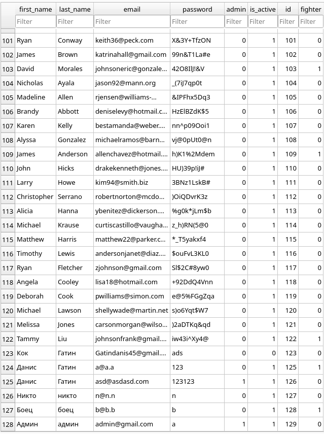

# Testovoe_Effective_mobile

### Система разграничения прав доступа:

Есть 3 вида пользователей:
- Обычный пользователь - обладает минимальным доступом
- Боец - "имеет доступ к ресурсу по вышеописанным правилам" (может смотреть правила клуба)
- Администратор - Может изменять права доступа у всех пользователей, не включая других администраторов, может просматривать эти правила (правила прав доступа)

В бд для проверки есть следующие пользователи (данные для входа)

Админ (Админ, не боец) - почта:admin@gmail.com пароль:a
Боец (не админ, боец) - почта:b@b.b пароль:b
Никто (не админ, не боец) - почта:n@n.n пароль:n

